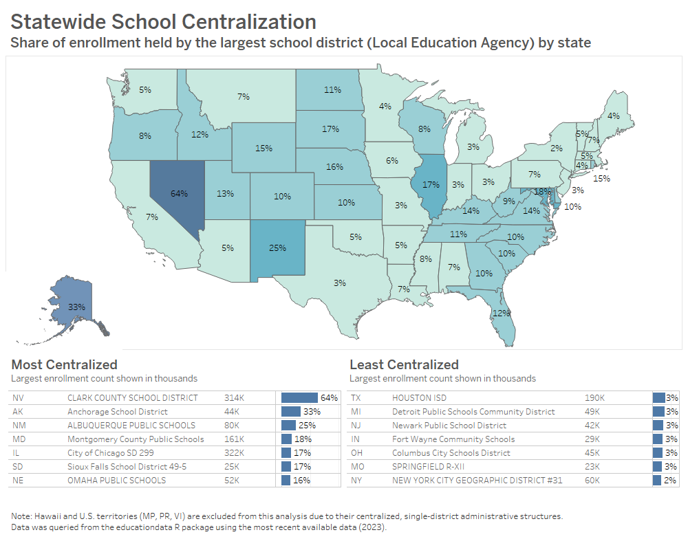

# Education Data and Analyses

This repository explores the Urban Institute’s `educationdata` package in R to visualize student enrollment distribution across the United States.

**[📊 Link to Interactive Tableau Dashboard] (https://public.tableau.com/app/profile/jonathan.wilson7172/viz/EnrollmentShareoftheLargestPublicSchoolDistrictbyState/Percentage)**



## Project Goal
The goal is to measure "Enrollment Concentration"—identifying what percentage of a state's total public school students attend the single largest federal reporting unit.

## The Data Unit: What is an LEA?
This analysis focuses on **Local Education Agencies (LEAs)**. 

* **Definition:** An LEA is the federal NCES term for a public board of education or authority that has administrative control over schools.
* 
* **The NYC Distinction:** While most LEAs correspond to a city or county school district, federal data subdivides New York City into 32 geographic LEAs. This means that while NYC is the largest administrative district in the US, it does not appear as the largest "LEA" in federal datasets.

## Requirements & Reproducibility
To replicate this analysis, ensure you have an active internet connection (to query the API) and the following R packages:

```r
install.packages(c("educationdata", "tidyverse"))
